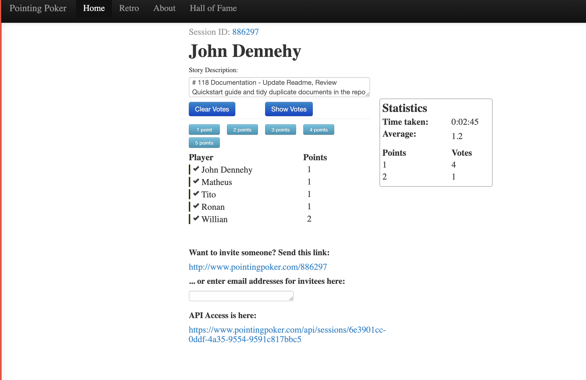
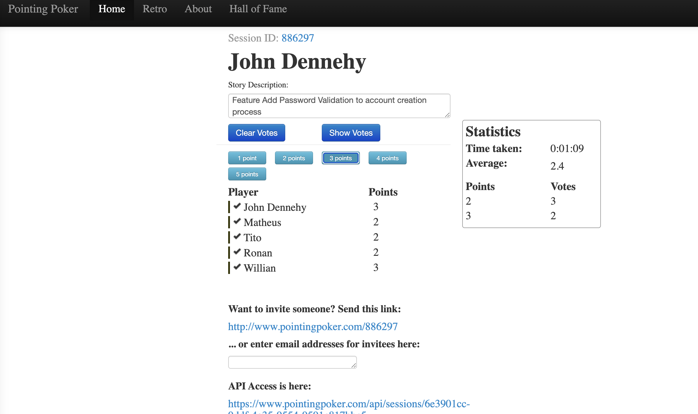
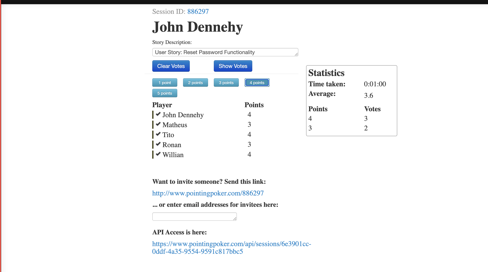
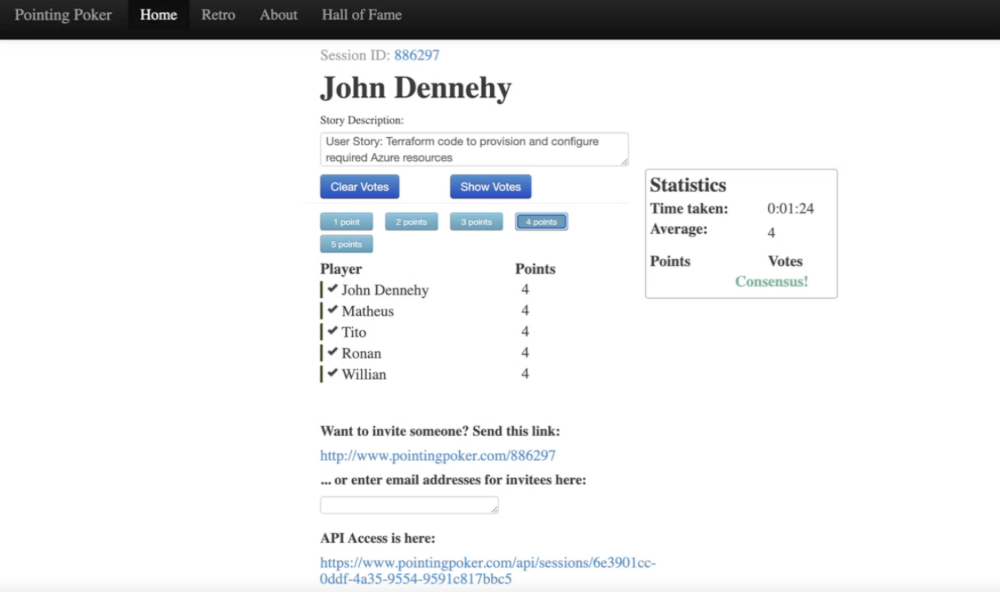
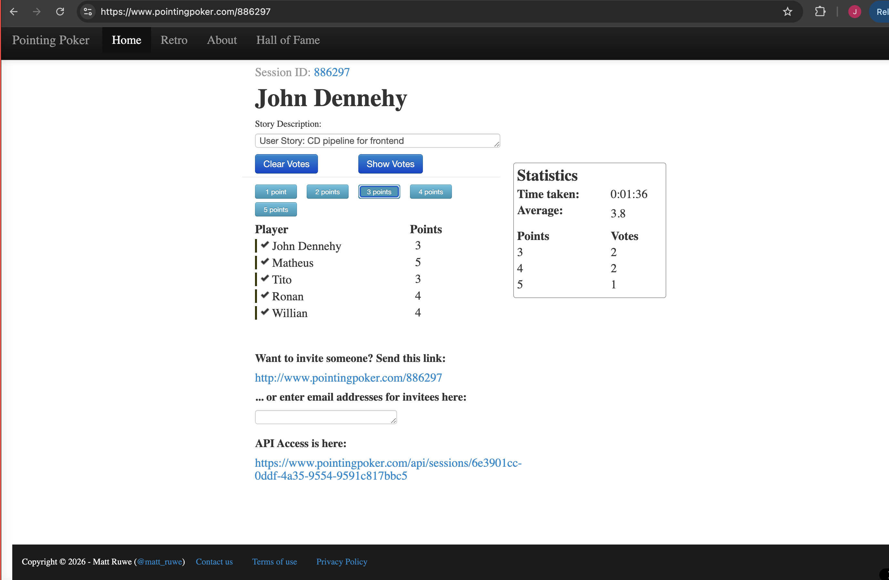
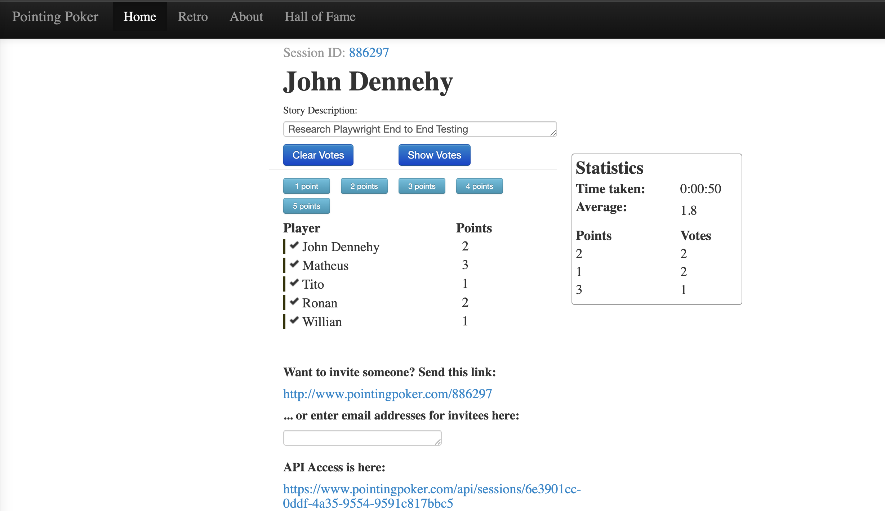
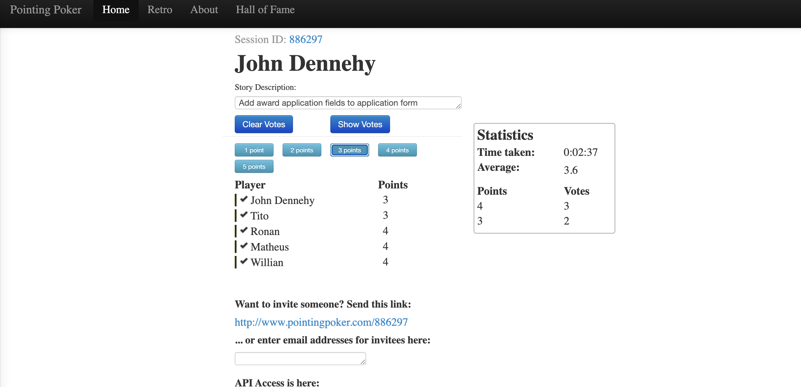

# Meeting Minutes: Nausicaä's Global Green Initiative - 05/03/2026

**Project:** Nausicaä's Global Green Initiative (Studio Ghibli Climate Change Grant System)  
**Team:** Group 2 - DevOps Project Management Assignment  
**Date:** 02 - 08 March 2026
**Time:** Meeting recorded (duration: ~0.5 hours)  
**Attendees:** John (Scrum Master - Week 10), Tito, Ronan, Willian, Matheus.

---

## 1. Meeting Overview

The meeting focused on conducting a sprint poker planning session for the current sprint to gain better estimations of tickets allocated. [Pointing Poker](https://www.pointingpoker.com/) used to enable each of the group to vote on their estimation for each task. Good consensus on majority of items.

Sizing used was as follows (results added to each ticket in GitHub):

- 1 (XS)
- 2 (S)
- 3 (M)
- 4 (L)
- 5 (XL)

Following this, each person gave an update on their current task and whether any blockers in place for current allocated tickets.

---

## 2. Key Findings

### 2.1 [Documentation](https://github.com/williancb-alt/Nausicaas-Global-Green-Initiative/issues/118)

Four people voted 1, one voted 2, decision to point at XS (1).

### 2.2 [Password validation](https://github.com/williancb-alt/Nausicaas-Global-Green-Initiative/issues/121)

Two people voted 3, three people voted 2.
Went with majority and pointed at S (2).

### 2.3 [Reset Password Functionality](https://github.com/williancb-alt/Nausicaas-Global-Green-Initiative/issues/111)

Two people voted 3, three people voted 4.
Went with majority and pointed at L (4).

### 2.4 [Terraform Code](https://github.com/williancb-alt/Nausicaas-Global-Green-Initiative/issues/66)

Discussion noted for this task to be broken down further into sub-tasks (John will do).

Everybody voted 4, went with that L (4).

### 2.5 [Deployment pipeline for frontend](https://github.com/williancb-alt/Nausicaas-Global-Green-Initiative/issues/57)

This is dependent on the above Terraform ticket being completed first.

Two voted 3, two voted 4, one voted 5.

Went with four as average of votes was 3.8, L (4).

### 2.6 [PlayWright Research](https://github.com/williancb-alt/Nausicaas-Global-Green-Initiative/issues/102)

Two voted 1, two voted 2, one voted 3.

Went with two as average of votes was 1.8, S (2).

### 2.7 [Add award application fields to application form](https://github.com/williancb-alt/Nausicaas-Global-Green-Initiative/issues/27)

Three voted 4, two voted 3.

Went with majority vote, pointed at L (4).

---

## 3. Next Steps

Each member to work through their allocated stories and tasks.
